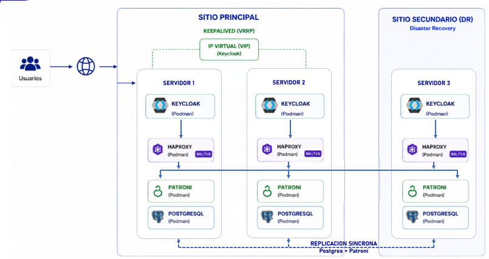

# Arquitectura Keycloak

## Descripción General

La plataforma está desplegada en una arquitectura de alta disponibilidad distribuida en dos sitios físicos o lógicos:

- **Sitio principal**: 2 servidores
- **Sitio secundario**: 1 servidor

La solución está compuesta por un total de **3 servidores**.

Cada servidor ejecuta los siguientes componentes:

- Keycloak
- HAProxy
- PostgreSQL + Patroni
- etcd

Todos los servicios se despliegan en contenedores utilizando **Podman**.



---

# Componentes de la Arquitectura

## Keycloak

Keycloak se ejecuta dentro de un contenedor utilizando HTTP interno.

La terminación SSL/TLS se realiza mediante **HAProxy**, el cual expone el servicio HTTPS hacia los clientes.

Funciones principales:

- Servicio de autenticación y autorización
- Administración de identidades
- Integración SSO
- Terminación SSL mediante HAProxy

---

## Base de Datos

La base de datos está implementada sobre un clúster de PostgreSQL administrado por Patroni.

### Componentes

#### PostgreSQL

Motor de base de datos principal.

El clúster se compone de:

- 1 nodo líder (*primary*)
- 2 nodos réplica (*replica/standby*)

La replicación se realiza de forma streaming entre nodos.

---

#### Patroni

Patroni administra el clúster PostgreSQL y realiza las siguientes funciones:

- Elección automática del nodo líder (*leader election*)
- Gestión de failover
- Promoción automática de réplicas
- Monitoreo del estado del clúster

Patroni y PostgreSQL se ejecutan dentro del mismo contenedor.

Patroni controla el ciclo de vida del proceso PostgreSQL, iniciando o deteniendo el servicio según el estado del clúster.

---

#### etcd

etcd es utilizado por Patroni como sistema de coordinación distribuida (*Distributed Configuration Store - DCS*).

Funciones principales:

- Mantener el consenso del clúster
- Coordinar la elección del líder
- Mantener quorum entre nodos
- Evitar escenarios de *split-brain*

El clúster etcd está compuesto por 3 nodos, permitiendo alcanzar mayoría (*majority quorum*) ante la falla de un servidor.

---

#### HAProxy

HAProxy se utiliza como proxy para las conexiones PostgreSQL y Keycloak.

Funciones:

- Redirección automática hacia el nodo PostgreSQL líder
- Balanceo de carga
- Terminación SSL/TLS para Keycloak
- Health checks sobre Patroni y Keycloak

Para determinar el nodo activo de PostgreSQL, HAProxy consulta el estado publicado por Patroni.

---

# Alta Disponibilidad

## Sitio Principal

En los dos servidores del sitio principal se utiliza **Keepalived** con protocolo **VRRP** para proporcionar alta disponibilidad mediante una dirección IP virtual (*VIP*).

Características:

- Failover automático de la VIP
- Continuidad del servicio ante caída de un servidor
- Exposición única del servicio hacia clientes

---

## Sitio Secundario

El tercer servidor se encuentra en el sitio secundario y cumple dos funciones principales:

### Quorum y Consenso

Permite mantener un número impar de miembros en el clúster etcd para alcanzar quorum y mantener consenso distribuido.

Esto permite:

- Elección correcta del líder
- Tolerancia a fallos
- Prevención de *split-brain*

---

### Recuperación ante Desastres (Disaster Recovery)

El servidor del sitio secundario actúa como nodo de recuperación ante desastres (*DR Site*).

En caso de caída completa del sitio principal:

- El servicio puede ser recuperado desde el sitio secundario
- PostgreSQL puede promoverse manualmente
- Los servicios Keycloak pueden continuar operando desde el nodo restante

---

# Escenarios de Falla

## Caída de un Servidor

El clúster continúa operando normalmente.

Características:

- Failover automático
- Recuperación automática
- Sin intervención manual

---

## Caída de Dos Servidores

Si dos servidores quedan fuera de servicio, el clúster pierde quorum.

En este escenario se requiere intervención manual para:

1. Reconstruir el clúster etcd en modo de nodo único
2. Validar el estado de PostgreSQL
3. Promover manualmente el nodo sobreviviente si es necesario
4. Reconfigurar DNS o balanceadores para apuntar al sitio secundario

---

# Tecnologías Utilizadas

| Componente | Función |
|---|---|
| Keycloak | IAM / SSO |
| PostgreSQL | Base de datos |
| Patroni | Orquestación HA PostgreSQL |
| etcd | Consenso distribuido |
| HAProxy | Proxy y balanceo |
| Keepalived | Alta disponibilidad VIP |
| Podman | Contenedores |

---

# Topología Simplificada

```text
                +----------------------+
                |      Clientes        |
                +----------+-----------+
                           |
                        VIP (VRRP)
                           |
          +----------------+----------------+
          |                                 |
+---------+---------+           +-----------+--------+
| Sitio Principal 1 |           | Sitio Principal 2 |
+-------------------+           +-------------------+
| Keycloak          |           | Keycloak          |
| HAProxy           |           | HAProxy           |
| PostgreSQL        |           | PostgreSQL        |
| Patroni           |           | Patroni           |
| etcd              |           | etcd              |
+-------------------+           +-------------------+

                   Replicación / Consenso

                 +-------------------+
                 | Sitio Secundario  |
                 +-------------------+
                 | Keycloak          |
                 | HAProxy           |
                 | PostgreSQL        |
                 | Patroni           |
                 | etcd              |
                 +-------------------+
```

---

# Consideraciones Operacionales

- El clúster requiere quorum de etcd para operaciones automáticas.
- Se recomienda mantener sincronización horaria mediante NTP.
- Los backups de PostgreSQL deben ejecutarse de manera independiente al clúster.
- La latencia entre sitios debe mantenerse baja para evitar degradación en replicación y consenso.
- Se recomienda monitoreo activo sobre:
  - Patroni
  - etcd
  - PostgreSQL replication lag
  - HAProxy health checks
  - Keepalived/VRRP
